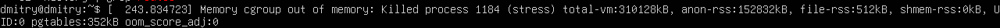

# Linux работа с памятью и процессами

## Задание 1. Systemd

Создаю файлик, устанавливаю нужные привилегии:
```
dmitry@host2:~$ sudo nano /usr/local/bin/homework_service.sh
dmitry@host2:~$ ls -l /usr/local/bin/homework_service.sh
-rw-r--r-- 1 root root 146 Oct  7 15:34 /usr/local/bin/homework_service.sh
dmitry@host2:~$ sudo chmod +x /usr/local/bin/homework_service.sh
dmitry@host2:~$ ls -l /usr/local/bin/homework_service.sh
-rwxr-xr-x 1 root root 146 Oct  7 15:34 /usr/local/bin/homework_service.sh
```

Создаю unit `/etc/systemd/system/homework.service` с таким содержимым:
```
[Unit]
Description=Homework Service

[Service]
ExecStart=/usr/local/bin/homework_service.sh
Restart=always
RestartSec=15

[Install]
WantedBy=multi-user.target
```

Заставляю systemd перечитать юниты и стартовать демон:
```
dmitry@host2:~$ sudo systemctl daemon-reload
dmitry@host2:~$ sudo systemctl start homework.service
```

Проверяю, что запущен:
```
dmitry@host2:~$ sudo systemctl status homework.service
dmitry@host2:~$ sudo systemctl status homework.service
● homework.service - Homework Service
     Loaded: loaded (/etc/systemd/system/homework.service; enabled; preset: enabled)
     Active: active (running) since Tue 2025-10-07 16:55:13 UTC; 2s ago
   Main PID: 2491 (homework_servic)
      Tasks: 2 (limit: 4614)
     Memory: 564.0K (peak: 800.0K)
        CPU: 36ms
     CGroup: /system.slice/homework.service
             ├─2491 /bin/bash /usr/local/bin/homework_service.sh
             └─2493 sleep 15

Oct 07 16:55:13 host2 systemd[1]: Started homework.service - Homework Service.
Oct 07 16:55:13 host2 homework_service.sh[2491]: My custom service has started.
```

Проверяю логи, раз в 15 с добавляется запись:
```
dmitry@host2:~$ tail -f /tmp/homework_service.log
Service heartbeat: Tue Oct  7 04:34:04 PM UTC 2025
Service heartbeat: Tue Oct  7 04:49:56 PM UTC 2025
Service heartbeat: Tue Oct  7 04:50:11 PM UTC 2025
Service heartbeat: Tue Oct  7 04:50:26 PM UTC 2025
Service heartbeat: Tue Oct  7 04:50:41 PM UTC 2025
Service heartbeat: Tue Oct  7 04:50:56 PM UTC 2025
Service heartbeat: Tue Oct  7 04:51:11 PM UTC 2025
Service heartbeat: Tue Oct  7 04:51:26 PM UTC 2025
Service heartbeat: Tue Oct  7 04:55:13 PM UTC 2025
Service heartbeat: Tue Oct  7 04:55:28 PM UTC 2025
Service heartbeat: Tue Oct  7 04:55:43 PM UTC 2025
Service heartbeat: Tue Oct  7 04:55:58 PM UTC 2025
^C
```

Добавляю в автозапуск:
```
dmitry@host2:~$ sudo systemctl enable homework.service
Created symlink /etc/systemd/system/multi-user.target.wants/homework.service → /etc/systemd/system/homework.service.
```

Грохаю сервис и проверяю рестарт:
```
dmitry@host2:~$ sudo kill 2491
dmitry@host2:~$ sudo systemctl status homework.service
● homework.service - Homework Service
     Loaded: loaded (/etc/systemd/system/homework.service; enabled; preset: enabled)
     Active: activating (auto-restart) since Tue 2025-10-07 16:56:15 UTC; 3s ago
    Process: 2491 ExecStart=/usr/local/bin/homework_service.sh (code=killed, signal=TERM)
   Main PID: 2491 (code=killed, signal=TERM)
        CPU: 256ms
dmitry@host2:~$ sudo systemctl status homework.service
● homework.service - Homework Service
     Loaded: loaded (/etc/systemd/system/homework.service; enabled; preset: enabled)
     Active: activating (auto-restart) since Tue 2025-10-07 16:56:15 UTC; 8s ago
    Process: 2491 ExecStart=/usr/local/bin/homework_service.sh (code=killed, signal=TERM)
   Main PID: 2491 (code=killed, signal=TERM)
        CPU: 256ms
dmitry@host2:~$ tail -f /tmp/homework_service.log
Service heartbeat: Tue Oct  7 04:50:41 PM UTC 2025
Service heartbeat: Tue Oct  7 04:50:56 PM UTC 2025
Service heartbeat: Tue Oct  7 04:51:11 PM UTC 2025
Service heartbeat: Tue Oct  7 04:51:26 PM UTC 2025
Service heartbeat: Tue Oct  7 04:55:13 PM UTC 2025
Service heartbeat: Tue Oct  7 04:55:28 PM UTC 2025
Service heartbeat: Tue Oct  7 04:55:43 PM UTC 2025
Service heartbeat: Tue Oct  7 04:55:58 PM UTC 2025
Service heartbeat: Tue Oct  7 04:56:13 PM UTC 2025
Service heartbeat: Tue Oct  7 04:56:30 PM UTC 2025
Service heartbeat: Tue Oct  7 04:56:45 PM UTC 2025
Service heartbeat: Tue Oct  7 04:57:00 PM UTC 2025
^C
```

Смотрю наиболее медленно стартующие сервисы:
```
dmitry@host2:~$ systemd-analyze blame | head -n 5
28.997s snapd.seeded.service
27.503s snapd.service
19.392s motd-news.service
15.288s homework.service
14.371s apport.service
```


## Задание 2. Межпроцессное взаимодействие (IPC) с разделяемой памятью

Скопипастил код и команды запуска из задания.

```
dmitry@dmitry:~$ ./shm_creator
Shared memory segment created.
ID: 1
Key: 0x41000011
Run 'ipcs -m' to see it. Process will exit in 60 seconds...
```

```
dmitry@dmitry:~$ ipcs -m

------ Shared Memory Segments --------
key        shmid      owner      perms      bytes      nattch     status      
0x41000011 1          dmitry     666        1024       0   
```

По истечении 60 с табличка, естественно, опустевает. С первыми 5 столбцами как будто всё ожидаемо. Столбец `nattch` показывает, сколько процессов подключено к сегменту. Мы же не подключаемся, а просто создаём и ждём. Инкремент этого значения происходит при вызове `shmat` (*Upon successful completion, shmat() shall increment the value of shm_nattch in the data structure associated with the shared memory ID of the attached shared memory segment* — https://man7.org/linux/man-pages/man3/shmat.3p.html), декремент — по `shmdt` (*Upon successful completion, shmdt() shall decrement the value of shm_nattch in the data structure associated with the shared memory ID of the attached shared memory segment* — https://man7.org/linux/man-pages/man3/shmdt.3p.html). При создании по `shmget` инициализируем нулём (*When a new shared memory segment is created, its contents are initialized to zero values, and its associated data structure, hmid_ds (see shmctl(2)), is initialized as follows: ... shm_lpid, shm_nattch, shm_atime, and shm_dtime are set to 0.*).

Добавляю вызов shm_attach для теста:
```
...
    printf("ID: %d\nKey: 0x%x\n", shmid, key);
    sleep(15);
    shmat(shmid, NULL, 0);
    printf("Run 'ipcs -m' to see it. Process will exit in 60 seconds...\n");
...
```

Ожидаемо получаю 1 спустя 15 с:
```
dmitry@dmitry:~$ ipcs -m

------ Shared Memory Segments --------
key        shmid      owner      perms      bytes      nattch     status      
0x41000011 2          dmitry     666        1024       0                       

dmitry@dmitry:~$ ipcs -m

------ Shared Memory Segments --------
key        shmid      owner      perms      bytes      nattch     status      
0x41000011 2          dmitry     666        1024       1
```

Ещё есть колонка `status`. Мы никаких флагов при создании не ставили, поэтому она пустая. Если же, например, сотворить такое: `shmctl(shmid, SHM_LOCK, NULL);`, то получим:
```
dmitry@dmitry:~$ ipcs -m

------ Shared Memory Segments --------
key        shmid      owner      perms      bytes      nattch     status      
0x41000011 3          dmitry     666        1024       1                 locked
```

Ещё можно заметить, что ключ не меняется (`ftok` работает детерминированно), а id инкрементится на каждом запуске, т. к. каждый раз просим ядро создать новый сегмент (`IPC_CREAT` — *Create a new segment.  If this flag is not used, then shmget() will find the segment associated with key and check to see if the user has permission to access the segment.* — https://www.man7.org/linux/man-pages/man2/shmget.2.html).


## Задание 3. Анализ памяти процессов (VSZ vs RSS)

```
dmitry@dmitry:~$ python3 -c "print('Allocating memory...'); a = 'X' * (250 * 1024 * 1024); import time; print('Memory allocated. Sleeping...'); time.sleep(120);"&
[1] 2890
dmitry@dmitry:~$ Allocating memory...
Memory allocated. Sleeping...
```

```
dmitry@dmitry:~$ ps -o pid,user,%mem,rss,vsz,comm -p 2890
    PID USER     %MEM   RSS    VSZ COMMAND
   2890 dmitry    6.6 265472 273268 python3
```

Если убрать команду `a = ...`:
```
dmitry@dmitry:~$ ps -o pid,user,%mem,rss,vsz,comm -p 2918
    PID USER     %MEM   RSS    VSZ COMMAND
   2918 dmitry    0.2  9472  17260 python3
```

Запрашивали 256.000 КБ под строчку. По RSS ровно такая разница. Здесь реальная память заиспользовалась потому, что мы не только сказали: «Система, дай нам кусок памяти», а ещё и записали в него что-то. И стек, и куча, естественно, должны где-то храниться. Без создания строки RSS ненулевой, т. к. Питон тоже не бесплатный и что-то пишет.

А то, что VSZ > RSS, — совершенно ожидаемое состояние, т. к. в виртуальной памяти держатся неинициализированные куски памяти, загруженные библиотеки и пр. 


## Задание 4. NUMA и cgroups

Смотрим ноды, их ядра и память:
```
dmitry@dmitry:~$ numactl --hardware
available: 1 nodes (0)
node 0 cpus: 0 1 2 3
node 0 size: 3900 MB
node 0 free: 2794 MB
node distances:
node   0 
  0:  10 
```

Т. е. одна NUMA-нода с 3900 МБ RAM.

Сервис из задания убил oom-killer:
```
dmitry@dmitry:~$ systemd-cgls
CGroup /:
-.slice
├─user.slice
│ └─user-1000.slice
│   ├─user@1000.service …
│   │ └─init.scope
│   │   ├─872 /usr/lib/systemd/systemd --user
│   │   └─873 (sd-pam)
│   ├─session-3.scope
│   │ ├─ 844 /bin/login -p --
│   │ └─1085 -bash
│   ├─session-1.scope
│   │ ├─845 sshd: dmitry [priv]
│   │ ├─982 sshd: dmitry@pts/0
│   │ └─983 -bash
│   └─session-5.scope
│     ├─1109 sshd: dmitry [priv]
│     ├─1164 sshd: dmitry@pts/1
│     ├─1165 -bash
│     ├─1186 systemd-cgls
│     └─1187 pager
├─init.scope
│ └─1 /sbin/init
└─system.slice
  ├─systemd-networkd.service
  │ └─562 /usr/lib/systemd/systemd-networkd
  ├─systemd-udevd.service …
  │ └─udev
  │   └─387 /usr/lib/systemd/systemd-udevd
  ├─cron.service
  │ └─833 /usr/sbin/cron -f -P
  ├─polkit.service
  │ └─690 /usr/lib/polkit-1/polkitd --no-debug
  ├─multipathd.service
  │ └─368 /sbin/multipathd -d -s
  ├─ModemManager.service
  │ └─757 /usr/sbin/ModemManager
  ├─systemd-journald.service
  │ └─314 /usr/lib/systemd/systemd-journald
  ├─unattended-upgrades.service
  │ └─737 /usr/bin/python3 /usr/share/unattended-upgrades/unattended-upgrade-shutdown --wait-for-signal
  ├─ssh.service
  │ └─841 sshd: /usr/sbin/sshd -D [listener] 0 of 10-100 startups
  ├─rsyslog.service
  │ └─740 /usr/sbin/rsyslogd -n -iNONE
  ├─systemd-resolved.service
  │ └─593 /usr/lib/systemd/systemd-resolved
  ├─udisks2.service
  │ └─700 /usr/libexec/udisks2/udisksd
  ├─dbus.service
  │ └─685 @dbus-daemon --system --address=systemd: --nofork --nopidfile --systemd-activation --syslog-only
  ├─systemd-timesyncd.service
  │ └─596 /usr/lib/systemd/systemd-timesyncd
  └─systemd-logind.service
    └─696 /usr/lib/systemd/systemd-logind
dmitry@dmitry:~$ systemctl status highload-stress-test.service
× highload-stress-test.service - /usr/bin/stress --cpu 1 --vm 1 --vm-bytes 300M --timeout 30s
     Loaded: loaded (/run/systemd/transient/highload-stress-test.service; transient)
  Transient: yes
     Active: failed (Result: oom-kill) since Wed 2025-10-08 09:17:02 UTC; 26s ago
   Duration: 45ms
    Process: 1182 ExecStart=/usr/bin/stress --cpu 1 --vm 1 --vm-bytes 300M --timeout 30s (code=exited, status=1/FAILURE)
   Main PID: 1182 (code=exited, status=1/FAILURE)
        CPU: 69ms

Oct 08 09:17:02 dmitry systemd[1]: Started highload-stress-test.service - /usr/bin/stress --cpu 1 --vm 1 --vm-bytes 300M --timeout 30s.
Oct 08 09:17:02 dmitry stress[1182]: stress: info: [1182] dispatching hogs: 1 cpu, 0 io, 1 vm, 0 hdd
Oct 08 09:17:02 dmitry stress[1182]: stress: FAIL: [1182] (425) <-- worker 1184 got signal 9
Oct 08 09:17:02 dmitry stress[1182]: stress: WARN: [1182] (427) now reaping child worker processes
Oct 08 09:17:02 dmitry stress[1182]: stress: FAIL: [1182] (461) failed run completed in 0s
Oct 08 09:17:02 dmitry systemd[1]: highload-stress-test.service: A process of this unit has been killed by the OOM killer.
Oct 08 09:17:02 dmitry systemd[1]: highload-stress-test.service: Main process exited, code=exited, status=1/FAILURE
Oct 08 09:17:02 dmitry systemd[1]: highload-stress-test.service: Failed with result 'oom-kill'.
```

На самом сервере такое сообщение (в терминале, через который я работаю по ssh, такого не было):


Ровно 150 — то же самое, а вот со 100 МБ завелось:

```
dmitry@dmitry:~$ sudo systemd-run --unit=highload-stress-test3 --slice=testing3.slice --property="MemoryMax=150M" --property="CPUWeight=100" stress --cpu 1 --vm 1 --vm-bytes 100M --timeout 30s
Running as unit: highload-stress-test3.service; invocation ID: 24d6870b2b1040b79e3ffa0b985c9c86
```

```
dmitry@dmitry:~$ systemd-cgls
CGroup /:
-.slice
├─user.slice
│ └─user-1000.slice
│   ├─user@1000.service …
│   │ └─init.scope
│   │   ├─872 /usr/lib/systemd/systemd --user
│   │   └─873 (sd-pam)
│   ├─session-3.scope
│   │ ├─ 844 /bin/login -p --
│   │ └─1085 -bash
│   ├─session-1.scope
│   │ ├─845 sshd: dmitry [priv]
│   │ ├─982 sshd: dmitry@pts/0
│   │ └─983 -bash
│   └─session-5.scope
│     ├─1109 sshd: dmitry [priv]
│     ├─1164 sshd: dmitry@pts/1
│     ├─1165 -bash
│     ├─1237 systemd-cgls
│     └─1238 pager
├─testing3.slice
│ └─highload-stress-test3.service
│   ├─1234 /usr/bin/stress --cpu 1 --vm 1 --vm-bytes 100M --timeout 30s
│   ├─1235 /usr/bin/stress --cpu 1 --vm 1 --vm-bytes 100M --timeout 30s
│   └─1236 /usr/bin/stress --cpu 1 --vm 1 --vm-bytes 100M --timeout 30s
├─init.scope
│ └─1 /sbin/init
└─system.slice
  ├─systemd-networkd.service
  │ └─562 /usr/lib/systemd/systemd-networkd
  ├─systemd-udevd.service …
  │ └─udev
  │   └─387 /usr/lib/systemd/systemd-udevd
  ├─cron.service
  │ └─833 /usr/sbin/cron -f -P
  ├─polkit.service
  │ └─690 /usr/lib/polkit-1/polkitd --no-debug
  ├─multipathd.service
  │ └─368 /sbin/multipathd -d -s
  ├─ModemManager.service
  │ └─757 /usr/sbin/ModemManager
  ├─systemd-journald.service
  │ └─314 /usr/lib/systemd/systemd-journald
  ├─unattended-upgrades.service
  │ └─737 /usr/bin/python3 /usr/share/unattended-upgrades/unattended-upgrade-shutdown --wait-for-signal
  ├─ssh.service
  │ └─841 sshd: /usr/sbin/sshd -D [listener] 0 of 10-100 startups
  ├─rsyslog.service
  │ └─740 /usr/sbin/rsyslogd -n -iNONE
  ├─systemd-resolved.service
  │ └─593 /usr/lib/systemd/systemd-resolved
  ├─udisks2.service
  │ └─700 /usr/libexec/udisks2/udisksd
  ├─dbus.service
  │ └─685 @dbus-daemon --system --address=systemd: --nofork --nopidfile --systemd-activation --syslog-only
  ├─systemd-timesyncd.service
  │ └─596 /usr/lib/systemd/systemd-timesyncd
  └─systemd-logind.service
    └─696 /usr/lib/systemd/systemd-logind
dmitry@dmitry:~$ systemctl status highload-stress-test3.service
● highload-stress-test3.service - /usr/bin/stress --cpu 1 --vm 1 --vm-bytes 100M --timeout 30s
     Loaded: loaded (/run/systemd/transient/highload-stress-test3.service; transient)
  Transient: yes
     Active: active (running) since Wed 2025-10-08 09:34:54 UTC; 25s ago
   Main PID: 1234 (stress)
      Tasks: 3 (limit: 4546)
     Memory: 25.9M (max: 150.0M available: 123.5M peak: 101.1M)
        CPU: 51.480s
     CGroup: /testing3.slice/highload-stress-test3.service
             ├─1234 /usr/bin/stress --cpu 1 --vm 1 --vm-bytes 100M --timeout 30s
             ├─1235 /usr/bin/stress --cpu 1 --vm 1 --vm-bytes 100M --timeout 30s
             └─1236 /usr/bin/stress --cpu 1 --vm 1 --vm-bytes 100M --timeout 30s

Oct 08 09:34:54 dmitry systemd[1]: Started highload-stress-test3.service - /usr/bin/stress --cpu 1 --vm 1 --vm-bytes 100M --timeout 30s.
Oct 08 09:34:54 dmitry stress[1234]: stress: info: [1234] dispatching hogs: 1 cpu, 0 io, 1 vm, 0 hdd
```

Сначала зачем-то переименовывал слайс, но ничего не мешает нам поместить новый сервис в тот же срез, конечно:

```
dmitry@dmitry:~$ systemd-cgls
CGroup /:
-.slice
├─user.slice
...
└─testing.slice
  └─highload-stress-test3.service
    ├─1349 /usr/bin/stress --cpu 1 --vm 1 --vm-bytes 100M --timeout 30s
    ├─1350 /usr/bin/stress --cpu 1 --vm 1 --vm-bytes 100M --timeout 30s
    └─1351 /usr/bin/stress --cpu 1 --vm 1 --vm-bytes 100M --timeout 30s

```

`MemoryMax`, как увидели, ограничивает количество памяти, которое может использовать сервис. Попытается привысить — его убьют. Сделано это, очевидно, для предотвращения чрезмерного потребления процессом, которое могло бы лишить доступа к памяти другие процессы.

`CPUWeight` же ничего строго не ограничивает, а выставляет приоритет процессу. Более высокий означает большую вероятность доступа к ресурсам.

Можно также ограничивать не один процесс, как мы сделали, а группами по слайсам. Например: `sudo systemctl set-property testing.slice MemoryMax=150M`.
