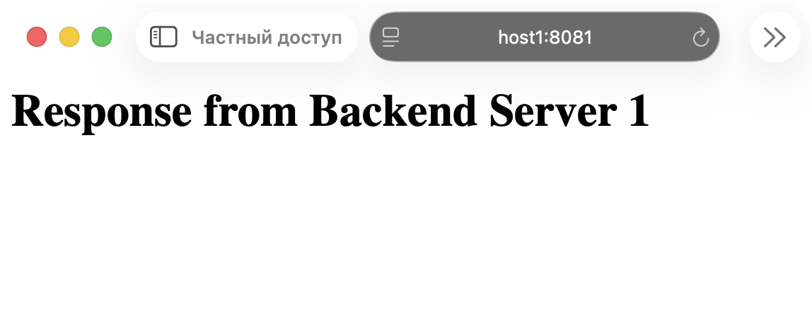
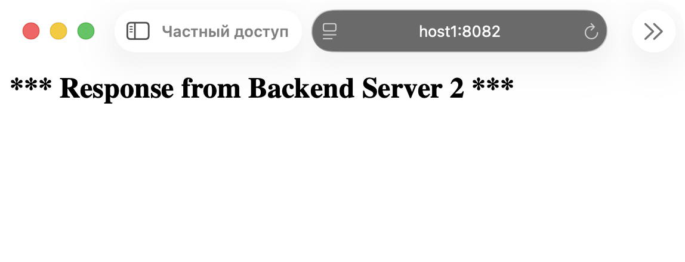

# WEB. High Performance WEB и CDN

## Задание 1. Создание Server Pool для backend

Создаю каталоги для серверов:
```
dmitry@host1:~$ mkdir backend1 && echo '<h1>Response from Backend Server 1</h1>' > backend1/index.html
dmitry@host1:~$ mkdir backend2 && echo '<h2>*** Response from Backend Server 2 ***</h2>' > backend2/index.html
dmitry@host1:~$ tree
.
├── backend1
│   └── index.html
├── backend2
│   └── index.html
...
```

Запускаю серверы:
```
dmitry@host1:~$ cd backend1
dmitry@host1:~/backend1$ python3 -m http.server 8081
Serving HTTP on 0.0.0.0 port 8081 (http://0.0.0.0:8081/) ...
```
```
dmitry@host1:~$ cd backend2
dmitry@host1:~/backend2$ python3 -m http.server 8082
Serving HTTP on 0.0.0.0 port 8082 (http://0.0.0.0:8082/) ...
```

Проверяю, что открываются:




